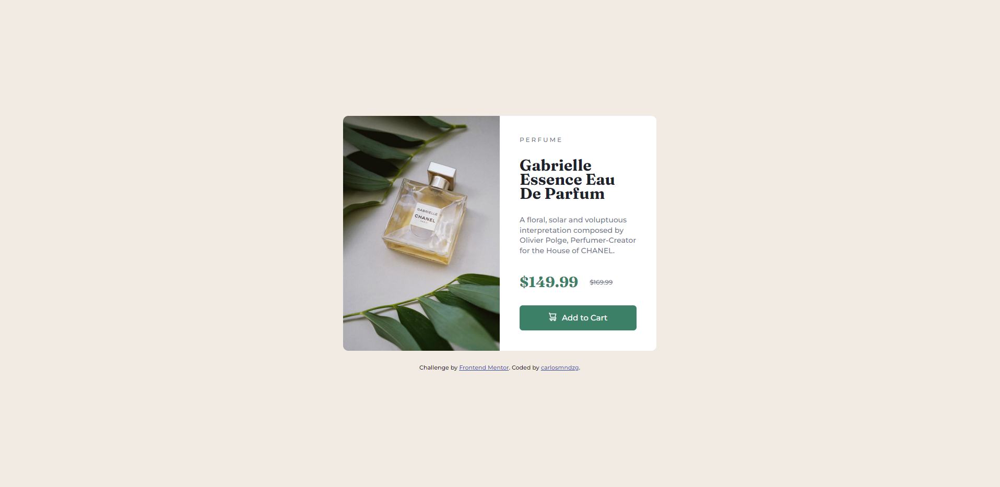

# Frontend Mentor - Product preview card component solution

This is a solution to the [Product preview card component challenge on Frontend Mentor](https://www.frontendmentor.io/challenges/product-preview-card-component-GO7UmttRfa). Frontend Mentor challenges help you improve your coding skills by building realistic projects.

## Table of contents

- [Overview](#overview)
  - [The challenge](#the-challenge)
  - [Screenshot](#screenshot)
  - [Links](#links)
- [My process](#my-process)
  - [Built with](#built-with)
  - [What I learned](#what-i-learned)

## Overview

### The challenge

Users should be able to:

- View the optimal layout depending on their device's screen size
- See hover and focus states for interactive elements

### Screenshot



### Links

- Solution URL: [Solution URL](https://github.com/carlosmndzg/product-card-component)
- Live Site URL: [Live Site URL](https://product-card-component-dev.netlify.app/)

## My process

### Built with

- Semantic HTML5 markup
- CSS custom properties
- Flexbox
- CSS Grid
- Mobile-first workflow

### What I learned

I have learnt how to use the picture element, which allows us among other things to use one image or another depending on the width of the viewport, as it's shown below:

```html
<picture class="card__img">
  <source
    srcset="/images/image-product-desktop.jpg"
    media="(min-width: 620px)"
  />
  
</picture>
```

Also how to insert svg as a pseudo element using url()

```css
.card__btn::before {
  content: url(/images/icon-cart.svg);
}
```

And also media-queries in Mobile-first using EM units, as well as getting more experience making responsive components.
